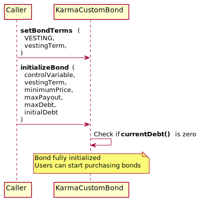
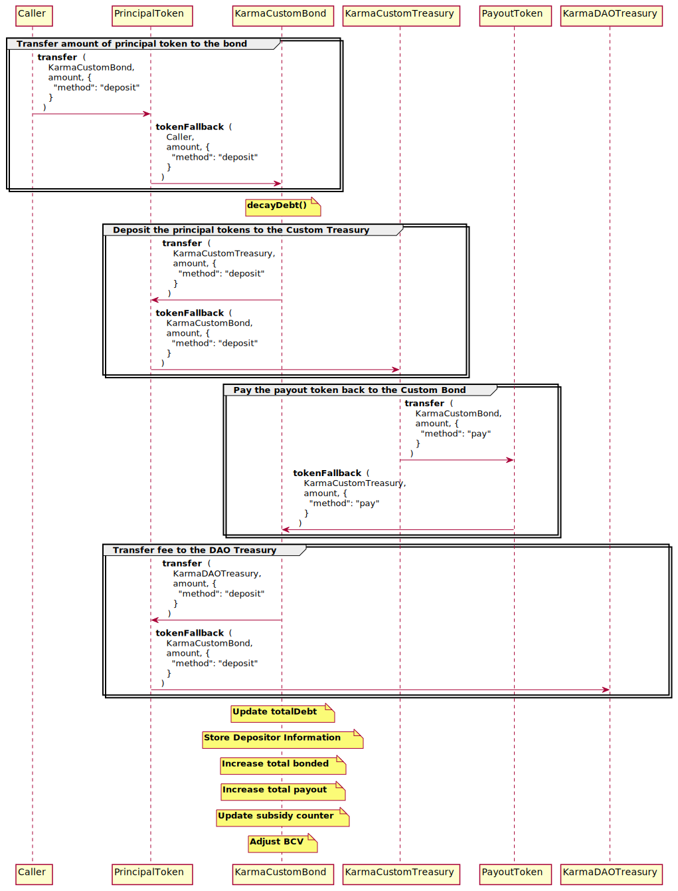

# Karma Custom Bond Documentation

---

## Initialization methods

## `KarmaCustomBond::constructor`

### 📜 Method Call

- Default contract constructor.
- Access: Everyone

```java
public KarmaCustomBond (
  Address customTreasury,
  Address payoutToken,
  Address principalToken,
  Address karmaTreasury,
  Address subsidyRouter,
  Address initialOwner,
  Address karmaDAO,
  BigInteger[] tierCeilings,
  BigInteger[] fees
)
```

- `customTreasury`: The custom treasury associated with the bond
- `payoutToken`: The payout token address associated with the bond, token paid for principal
- `principalToken`: The inflow token
- `karmaTreasury`: The Karma treasury
- `subsidyRouter`: pays subsidy in Karma to custom treasury
- `initialOwner`: The initial policy role address
- `karmaDAO`: The KarmaDAO contract address
- `tierCeilings`: Array of ceilings of principal bonded till next tier
- `fees`: Array of fees tiers, in ten-thousandths (i.e. 33300 = 3.33%)

---

## `KarmaCustomBond::initializeBond`



### 📜 Method Call

- Initializes bond parameters
- Access: Policy
- The debt must be 0 for initialization
- The vesting term must be initialized first with `setBondTerms(VESTING, ...)`
- Once the Custom Bond contract is initialized, users can start purchasing bonds

- Requirements:
  - The `currentDebt()` value must be equal to 0 when calling this method

```java
@External
public void initializeBond (
  BigInteger controlVariable,
  long vestingTerm, // in blocks
  BigInteger minimumPrice,
  BigInteger maxPayout,
  BigInteger maxDebt,
  BigInteger initialDebt
)
```

- `controlVariable`: The Bond Control Variable (BCV). Controls bond price and capacity. BCV directly affects the bond price - the higher the BCV, the higher the bond price. As a higher bond price makes bonds less attractive, the protocol can adjust this value to tune the bond capacity.
- `vestingTerm`: Vesting term (typically 7 days), expressed in ICON blocks. A bond vests linearly to the bonder over a length of time, called the bond vesting term. This means the bonder can claim a portion of the reward tokens each day, with all rewards being claimable at the end of the term.
- `minimumPrice`: Minimum price of the bond
- `maxPayout`: Max payout as a % of total supply, in thousandths of a %. i.e. 500 = 0.5%
- `maxDebt`: Ceiling on how many bonds can be outstanding
- `initialDebt`: Initial debt used for initializing the contract

### 🧪 Example call

```java
{
  "to": KarmaCustomBond,
  "method": "initializeBond",
  "params": {
    "controlVariable": "0x61a80", // 400000
    "vestingTerm": "0x49d40", // 302400, 1 week (7*24*3600/2) considering 2 seconds blocks
    "minimumPrice": "0x151b", // 5403
    "maxPayout": "0x1f4", // 500 = 0.5%
    "maxDebt": "0x12a05f200", // 5000000000
    "initialDebt": "0x5cfbb600" // 1560000000
  }
}
```

---

## Policy Functions


## `KarmaCustomBond::setBondTerms`

### 📜 Method Call

- Change the parameters of a bond
- Access: Policy

```java
@External
public void setBondTerms (
    int parameter,
    BigInteger input
)
```

- `parameter`: The input type, its value is either 0 (VESTING, set the `vestingTerm` blocks value), 1 (PAYOUT, set the `maxPayout` value) or 2 (DEBT, set the `maxDebt` value)
- `input`: The input value
- Requirements:
  - For `VESTING`, the vesting time must be longer than 36 hours. The contract assume a 2 seconds block time.
  - For `PAYOUT`, the max payout cannot be above 1 percent

### 🧪 Example call

```java
{
  "to": KarmaCustomBond,
  "method": "setBondTerms",
  "params": {
    "parameter": "0x0", // VESTING, set the vesting block
    "input": "0x93a80", // 604800, 2 weeks
  }
}
```

```java
{
  "to": KarmaCustomBond,
  "method": "setBondTerms",
  "params": {
    "parameter": "0x1", // PAYOUT, set the max payout
    "input": "0x1f4", // 500 = 0.5%
  }
}
```

---

## `KarmaCustomBond::setAdjustment`

### 📜 Method Call

- Set control variable adjustment
- Access: Policy
- Requirements:
  - The increment value must be inferior or equal to `BCV * 3 / 100`

```java
@External
public void setAdjustment (
  boolean addition,
  BigInteger increment,
  BigInteger target,
  long buffer
)
```

- `addition`: Addition (true) or subtraction (false) of BCV
- `increment`: The increment value of the `controlVariable` value
- `target`: BCV when adjustment finished
- `buffer`: Minimum length (in blocks) between adjustments

### 🧪 Example call

```java
{
  "to": KarmaCustomBond,
  "method": "setAdjustment",
  "params": {
    "addition": "0x1", // true, add
    "increment": "0x1", // increment BCV+1
    "target": "0x6", // BCV+6
    "buffer": "0x1" // 1 block
  }
}
```

---

## Custom Bond settings

## `KarmaCustomBond::changeKarmaTreasury`

### 📜 Method Call

- Change the Karma Treasury address
- Access: KarmaDAO

```java
@External
public void changeKarmaTreasury (
  Address karmaTreasury
)
```

- `karmaTreasury`: The new Karma Treasury address

### 🧪 Example call

```java
{
  "to": KarmaCustomBond,
  "method": "changeKarmaTreasury",
  "params": {
    "addition": "0x1", // true, add
    "increment": "0x1", // increment BCV+1
    "target": "0x6", // BCV+6
    "buffer": "0x1" // 1 block
  }
}
```

---

## `KarmaCustomBond::paySubsidy`

### 📜 Method Call

- Subsidy controller checks payouts since last subsidy and resets counter
- Access: Subsidy Router

```java
@External
public BigInteger paySubsidy()
```

### 🧪 Example call

```java
{
  "to": KarmaCustomBond,
  "method": "paySubsidy"
}
```

---

## User functions


## `KarmaCustomBond::deposit`



### 📜 Method Call

- Deposit the principal IRC2 token to the bond
- Access: Everyone

```java
// @External - this method is external through tokenFallback
private void deposit (
  Address caller, 
  Address token, 
  BigInteger amount, 
  BigInteger maxPrice,
  Address depositor
)
```

- `caller`: The method caller. This field is handled by tokenFallback
- `token`: Only principalToken is accepted. This field is handled by tokenFallback
- `amount`: Amount of principal inflow token received. This field is handled by tokenFallback
- `maxPrice`: Max price for slippage protection. `maxPrice` value needs to be superior or equal to the bond price, otherwise the transaction will fail.
- `depositor`: Registered depositor of the bond

- Requirements:
  - Only principal token accepted for deposit
  - `maxPrice` must be superior or equal to `trueBondPrice`
  - The `amount` deposited mustn't overflow the max debt
  - The `payout` deposited must be > 0.01 payout token (underflow protection)
  - The `payout` deposited mustn't superior to `maxPayout()`

### 🧪 Example call

```java
{
  "to": principalTokenAddress,
  "method": "transfer",
  "params": {
    "_to": KarmaCustomBond,
    "_value": "0xde0b6b3a7640000", // 10**18 - equivalent to amount parameter
    "_data": hex({
      "method": "deposit",
      "params": {
        "maxPrice": "0x1158e460913d00000" // 20 * 10**18
        "depositor": alice
      }
    })
  }
}
```

## `KarmaCustomBond::depositIcx`

### 📜 Method Call

- Deposit ICX (principal token) to the bond
- Access: Everyone

```java
@External
@Payable
public void depositIcx (BigInteger maxPrice, Address depositor)
```

- See `KarmaCustomBond::deposit` documentation

---

## `KarmaCustomBond::redeem`


### 📜 Method Call

- Redeem bond for user
- Access: Everyone who made a bond deposit
- Returns the payout amount

```java
@External
public BigInteger redeem (
    Address depositor
)
```

- `depositor`: Depositor address, it will also be used as a destination address for the redeemed tokens

- Requirements:
  - Only the depositor with an existing bond can call this method

### 🧪 Example call

```java
{
  "to": KarmaCustomBond,
  "method": "redeem",
  "params": {
    "addition": "0x1", // true, add
    "increment": "0x1", // increment BCV+1
    "target": "0x6", // BCV+6
    "buffer": "0x1" // 1 block
  }
}
```

---

## View functions

## `KarmaCustomBond::bondPrice`

### 📜 Method Call

- Calculate current bond premium
- price = `BCV` * `debtRatio` / (10**(`IRC2(payoutToken).decimals()` - `DECIMALS_PRECISION`))
- if price is < 0, price = `terms().minimumPrice`

```java
@External(readonly = true)
public BigInteger bondPrice()
```

### 🧪 Example call

```java
{
  "to": KarmaCustomBond,
  "method": "bondPrice"
}
```

Result:
```java
0x4f26
```

---

## `KarmaCustomBond::trueBondPrice`

### 📜 Method Call

- Calculate true bond price a user pays
- truePrice = `bondPrice()` + (`bondPrice()` * `currentKarmaFee()` / 10**TRUE_BOND_PRICE_PRECISION)

```java
@External(readonly = true)
public BigInteger trueBondPrice()
```

### 🧪 Example call

```java
{
  "to": KarmaCustomBond,
  "method": "trueBondPrice"
}
```

Result:
```java
0x51c8
```

---

## `KarmaCustomBond::maxPayout`

### 📜 Method Call

- Determine maximum bond size
- maxBondSize = IRC2(payoutToken).totalSupply() * terms().maxPayout / 10**DECIMALS_PRECISION

```java
@External(readonly = true)
public BigInteger maxPayout()
```

### 🧪 Example call

```java
{
  "to": KarmaCustomBond,
  "method": "maxPayout"
}
```

Result:
```java
0x1b87506a3e7b0d400000 // 130000000000000000000000
```

---

## `KarmaCustomBond::payoutFor`

### 📜 Method Call

- Calculate user's interest due for new bond, accounting for Karma Fee
- `total` = `value * 10**18 / bondPrice() / 10**TOTAL_PAYOUT_PRECISION`
- `payoutFor` = `total - (total * currentKarmaFee() / 10**PAYOUT_PRECISION)`

```java
@External(readonly = true)
public BigInteger payoutFor(
  BigInteger value
)
```

### 🧪 Example call

```java
{
  "to": KarmaCustomBond,
  "method": "payoutFor",
  "params": {
    "value": "0x3e8" // 1000
  }
}
```

Result:
```java
0x74c02 // 478210
```

---

## `KarmaCustomBond::debtRatio`

### 📜 Method Call

- Calculate current ratio of debt to payout token supply
- Protocols using Karma Bond should be careful when quickly adding large %s to total supply
- `debtRatio` = `currentDebt()` * `IRC2(payoutToken).decimals()` / `IRC2(payoutToken).totalSupply()` / 10**18

```java
@External(readonly = true)
public BigInteger debtRatio()
```

### 🧪 Example call

```java
{
  "to": KarmaCustomBond,
  "method": "debtRatio"
}
```

Result:
```java
0x1c5a0eae924 // 1948319934756
```

---

## `KarmaCustomBond::currentDebt`

### 📜 Method Call

- Calculate debt factoring in decay
- `currentDebt` = `totalDebt()` - `debtDecay()`

```java
@External(readonly = true)
public BigInteger currentDebt()
```

### 🧪 Example call

```java
{
  "to": KarmaCustomBond,
  "method": "currentDebt"
}
```

Result:
```java
0x699e5ee2050eac4519 // 1948319934756655219993
```

---

## `KarmaCustomBond::debtDecay`

### 📜 Method Call

- Amount to decay total debt by
- `debtDecay` = `totalDebt()` * (`blockHeight` - `lastDecay()`) / (`terms().vestingTerm`)

```java
@External(readonly = true)
public BigInteger debtDecay()
```

### 🧪 Example call

```java
{
  "to": KarmaCustomBond,
  "method": "debtDecay"
}
```

Result:
```java
0xe4ffa9e425b2c779 // 16501094357058897785
```

---

## `KarmaCustomBond::percentVestedFor`

### 📜 Method Call

- Calculate how far into vesting a depositor is
- `bond` = `bondInfo.get(depositor)`
- `percentVestedFor` = (`blockHeight` - `bond.lastBlock`) * FULLY_VESTED / `bond.vesting`

```java
@External(readonly = true)
public BigInteger percentVestedFor (
  Address depositor
)
```

- `depositor`: The depositor address to calculate the vesting for

### 🧪 Example call

```java
{
  "to": KarmaCustomBond,
  "method": "percentVestedFor",
  "params": {
    "depositor": alice
  }
}
```

Result:
```java
0x101b // 4123
```

---

## `KarmaCustomBond::pendingPayoutFor`

### 📜 Method Call

- Calculate amount of payout token available for claim by depositor
- `payout` = `bondInfo.get(depositor).payout`
- If not vested: `pendingPayoutFor` = `payout`
- Else: `pendingPayoutFor` = `payout` * `percentVestedFor(depositor)` / FULLY_VESTED

```java
@External(readonly = true)
public BigInteger pendingPayoutFor (
  Address depositor
)
```

- `depositor`: The depositor address to calculate the vesting for

### 🧪 Example call

```java
{
  "to": KarmaCustomBond,
  "method": "pendingPayoutFor",
  "params": {
    "depositor": alice
  }
}
```

Result:
```java
0x433a6fc948839611cd5 // 19842282534854994238677
```

---

## `KarmaCustomBond::currentKarmaFee`

### 📜 Method Call

- Get the current fee Karma takes of each bond

```java
@External(readonly = true)
public BigInteger currentKarmaFee ()
```

### 🧪 Example call

```java
{
  "to": KarmaCustomBond,
  "method": "currentKarmaFee"
}
```

Result:
```java
0x8214 // 33300, 3.33%
```
