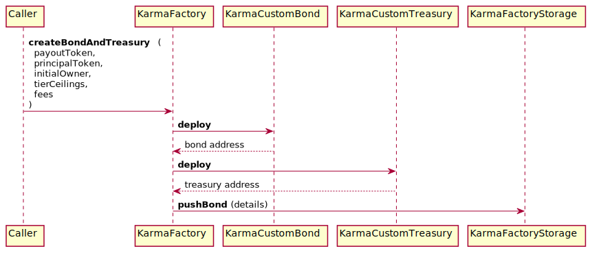

# Karma Factory Documentation

The Karma Factory is able to deploy new bond and treasury contracts. Only the contract Policy role can modify its state.

---

## `KarmaFactory::constructor`

### 📜 Method Call

- Default contract constructor.
- Access: Everyone
- By default, the policy owner is the deployer of the contract

```java
public KarmaFactory (
  Address karmaTreasury,
  Address karmaFactoryStorage,
  Address karmaSubsidyRouter,
  Address karmaDAO
)
```

- `karmaTreasury`: The Karma Treasury contract address
- `karmaFactoryStorage`: The Karma Factory Storage contract address
- `karmaSubsidyRouter`: The karma Subsidy Router contract address
- `karmaDAO`: The Karma DAO contract address


## `KarmaFactory::setCustomTreasuryContractBytes`

### 📜 Method Call

- Write the Custom Treasury Contract bytes. 
- Access: SCORE Owner
- Can only be called once after deploying.

```java
@External
public void setCustomTreasuryContractBytes (
  byte[] contractBytes
)
```

- `contractBytes`: The treasury contract bytes


## `KarmaFactory::setCustomBondContractBytes`

### 📜 Method Call

- Write the Custom Bond Contract bytes. 
- Access: SCORE Owner
- Can only be called once after deploying.

```java
@External
public void setCustomBondContractBytes (
  byte[] contractBytes
)
```

- `contractBytes`: The bond contract bytes


## `KarmaFactory::createBondAndTreasury`



### 📜 Method Call

- Deploys custom treasury and custom bond contracts and returns address of both
- Access: Policy
- Returns addresses of newly deployed bond and treasury contracts, encoded as [`TreasuryBond`](#karmafactorytreasurybond)
- Pushes the new bond details to the Factory Storage

```java
@External
public TreasuryBond createBondAndTreasury (
  Address payoutToken, 
  Address principalToken, 
  Address initialOwner, 
  BigInteger[] tierCeilings, 
  BigInteger[] fees
)
```

- `payoutToken`: The payout token address associated with the bond, token paid for principal
- `principalToken`: The principal inflow token address associated with the bond
- `initialOwner`: The initial owner of the bond
- `tierCeilings`: Array of ceilings of principal bonded till next tier
- `fees`: Array of fees tiers, in ten-thousandths (i.e. 33300 = 3.33%)

### 🧪 Example call

```java
{
  "to": KarmaFactory,
  "method": "createBondAndTreasury",
  "params": {
    "payoutToken": payoutToken,
    "principalToken": principalToken,
    "initialOwner": alice,
    "tierCeilings": [
      "0x3635c9adc5dea00000", 
      "0x6c6b935b8bbd400000", 
      "0xa2a15d09519be00000"
    ], // [1000 * 10**18, 2000 * 10**18, 3000 * 10**18]
    "fees": [
      "0x2710", 
      "0x4e20", 
      "0x7530"
    ] // [10000, 20000, 30000], 1%, 2%, 3%
  }
}
```

## `KarmaFactory::createBond`


### 📜 Method Call

- Deploys a custom bond contract and returns address of the factory and newly deployed bond
- Access: Policy
- Returns addresses of the factory and newly deployed bond contract, encoded as [`TreasuryBond`](#karmafactorytreasurybond)
- Pushes the new bond details to the Factory Storage

```java
@External
public TreasuryBond createBond (
  Address payoutToken, 
  Address principalToken, 
  Address customTreasury, 
  Address initialOwner, 
  BigInteger[] tierCeilings, 
  BigInteger[] fees
)
```

- `payoutToken`: The payout token address associated with the bond
- `principalToken`: The principal token address associated with the bond
- `customTreasury`: The custom treasury associated with the bond
- `initialOwner`: The initial owner of the bond
- `tierCeilings`: Array of ceilings of principal bonded till next tier
- `fees`: Array of fees tiers, in ten-thousandths (i.e. 33300 = 3.33%)

### 🧪 Example call

```java
{
  "to": KarmaFactory,
  "method": "createBondAndTreasury",
  "params": {
    "payoutToken": payoutToken,
    "principalToken": principalToken,
    "customTreasury": customTreasury,
    "initialOwner": alice,
    "tierCeilings": [
      "0x3635c9adc5dea00000", 
      "0x6c6b935b8bbd400000", 
      "0xa2a15d09519be00000"
    ], // [1000 * 10**18, 2000 * 10**18, 3000 * 10**18]
    "fees": [
      "0x2710", 
      "0x4e20", 
      "0x7530"
    ] // [10000, 20000, 30000], 1%, 2%, 3%
  }
}
```

## `KarmaFactory::TreasuryBond`

### ⚙️ Structure definition

```java
class TreasuryBond {
  Address treasury;
  Address bond;
}
```

- `treasury`: A treasury address
- `bond`: A bond address

# Public variable getters

## `KarmaFactory::karmaTreasury`

### 📜 Method Call

- Get the address of the Karma Treasury

```java
@External(readonly = true)
public Address karmaTreasury()
```

### 🧪 Example call

```java
{
  "to": KarmaFactory,
  "method": "karmaTreasury"
}
```

Result:
```java
cx000000000000000000000000000000000000000a
```

## `KarmaFactory::karmaFactoryStorage`

### 📜 Method Call

- Get the address of the Karma Factory Storage

```java
@External(readonly = true)
public Address karmaFactoryStorage()
```

### 🧪 Example call

```java
{
  "to": KarmaFactory,
  "method": "karmaFactoryStorage"
}
```

Result:
```java
cx000000000000000000000000000000000000000b
```

## `KarmaFactory::karmaSubsidyRouter`

### 📜 Method Call

- Get the address of the Karma Subsidy Router

```java
@External(readonly = true)
public Address karmaSubsidyRouter()
```

### 🧪 Example call

```java
{
  "to": KarmaFactory,
  "method": "karmaSubsidyRouter"
}
```

Result:
```java
cx000000000000000000000000000000000000000c
```

## `KarmaFactory::karmaDAO`

### 📜 Method Call

- Get the address of the Karma DAO contract

```java
@External(readonly = true)
public Address karmaDAO()
```

### 🧪 Example call

```java
{
  "to": KarmaFactory,
  "method": "karmaDAO"
}
```

Result:
```java
cx000000000000000000000000000000000000000d
```
