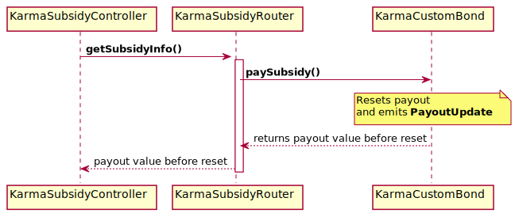

# Karma Subsidy Router Documentation


---

## `KarmaSubsidyRouter::constructor`

### 📜 Method Call

- Default contract constructor.
- Access: Everyone

```java
public KarmaSubsidyRouter ()
```

## `KarmaSubsidyRouter::addSubsidyController`

### 📜 Method Call

- Associate a new subsidy controller for a bond contract
- If there's already a bond associated for the given controller, it will silently override it
- Access: Policy

```java
@External
public void addSubsidyController (
  Address subsidyController,
  Address bond
)
```

- `subsidyController`: The Subsidy Controller address
- `bond`: A bond contract address

### 🧪 Example call

```java
{
  "to": KarmaSubsidyRouter,
  "method": "addSubsidyController",
  "params": {
    "subsidyController": "cx000000000000000000000000000000000000000c",
    "bond": "cx000000000000000000000000000000000000000b" // a bond contract
  }
}
```

## `KarmaSubsidyRouter::removeSubsidyController`

### 📜 Method Call

- Remove subsidy controller for bond contract
- Access: Policy

```java
@External
public void removeSubsidyController (
    Address subsidyController
)
```

- `subsidyController`: The Subsidy Controller address

### 🧪 Example call

```java
{
  "to": KarmaSubsidyRouter,
  "method": "removeSubsidyController",
  "params": {
    "subsidyController": "cx000000000000000000000000000000000000000c"
  }
}
```

## `KarmaSubsidyRouter::getSubsidyInfo`



### 📜 Method Call

- Subsidy controller fetches and resets payout counter
- Access: Subsidy Controller
- Emits a `PayoutUpdate` event in order to retrieve the payout new value

```java
@External
public BigInteger getSubsidyInfo()
```

### 🧪 Example call

```java
{
  "to": KarmaSubsidyRouter,
  "method": "getSubsidyInfo"
}
```

Emits:
```java
@EventLog
public void PayoutUpdate (
    BigInteger oldPayout,
    BigInteger newPayout
)
```

# Public variable getters

## `KarmaCustomTreasury::bondForController`

### 📜 Method Call

- Get the bond associated with a given controller

```java
@External(readonly = true)
public Address bondForController(Address controller)
```

### 🧪 Example call

```java
{
  "to": KarmaCustomTreasury,
  "method": "bondForController",
  "params": {
    "controller": "cx000000000000000000000000000000000000000c"
  }
}
```

Result:
```java
"cx000000000000000000000000000000000000000b" // a bond contract address
```
